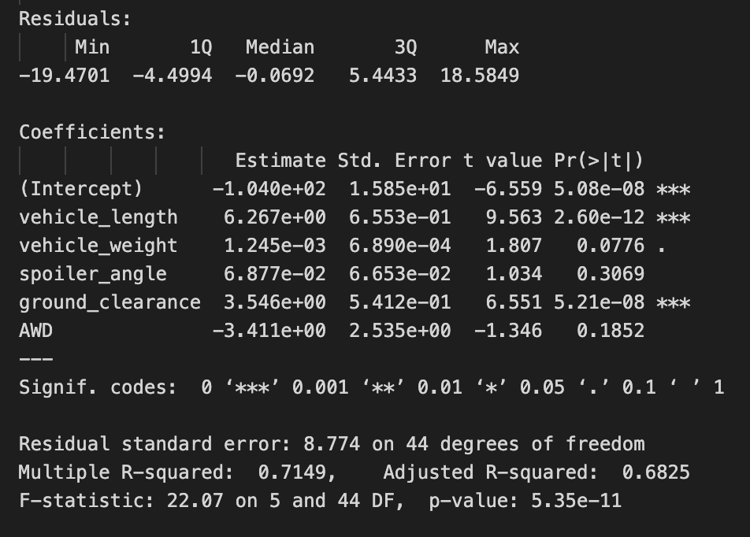
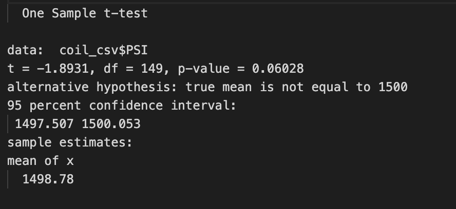
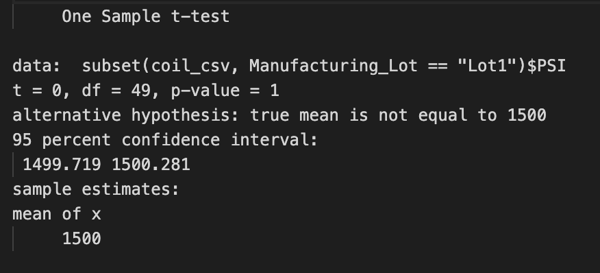
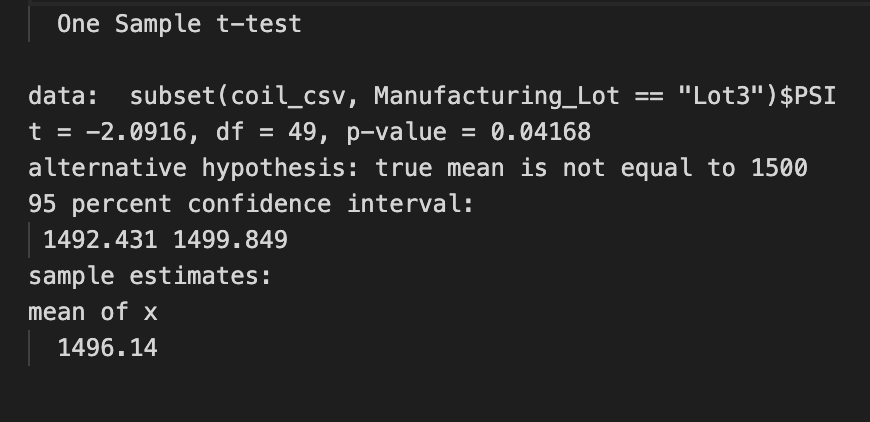

# MechaCar Statistical Analysis

## Linear Regression to Predict MPG

The following is the output of the linear regression used to predict the MPG:

- The slope of the linear model is not zero. The null hypothesis is rejected because our p-value is considerably lower than our significance level.

- As for the variables, the ground clearance and vehicle length are unlikely to provide random amounts of variance. This means that these two have a considerable effect on the MPG.
- The linear model decently predicts the MPG of the prototypes. This can be explained with the r squared, which in this case was .6825. This also means that almost 70% of the behavior can be explained by the linear model.

## Summary Statistics on Suspension Coils

The following image includes the summary statistics that compose all of the lots:

On the other hand, this next table has the summary statistics from each individual lot:

- Since the design specifications state that "the variance of the suspension coils must not exceed 100 pounds per square inch", it is important to analyze the obtained results.
- If we were to only look at the summary statistics that encompasses all the lots, then it would look like the variance is below the stated variance. However, the individual lot statistic give a quite different story. Lot 1 and lot 2 have a variance well below the upper limit. As for the third lot, it does not comply with the regulation since its variance is overly high, standing at 170.

## T-Tests on Suspension Coils

The following image contains the results of the t-test for the whole data set without grouping by lot:

- There is no evidence to reject the null hypothesis since the p-value (.06028) is greater than are significance value. This means that there is no statistical difference between the sample mean and the presumed population mean.

These next images contain the results of the t-test for the first, second, and third lot, respectively:

- With a p-value of 1, we are certain to fail to reject the null hypothesis.

- The null hypothesis will also be failed to be rejected since the p-value is higher than our significance level, meaning that it behaves the same as with the results above.

- This third lot behaves in a different manner in previous results. This is why there is no surprise that the null hypothesis is rejected in this case, meaning that the sample mean is statistically different than the population mean for the third lot.

## Study Design: MechaCar vs Competition

In the following proposal of a statistical study of hoy MechaCar perform against the competition, several metrics are of great importance for the consumers. The metrics would include:

- Horse Power
- Average customer satisfaction

The null hypothesis is that horsepower does not impact average customer satisfaction while the alternative hypothesis is that horsepower does impact average customer satisfaction.

I would use a one variable linear regression model since it would try to explain the behavior of the customer satisfaction based on the horsepower. This is quite a simple test but we will also be able to explain its effectiveness based on both the p-value and the r-squared. For this test, we need the average customer satisfaction, either as a number or as a qualitative value that can be converted into an integer. As for the horsepower, the data is already present and no further data gathering would be needed.
